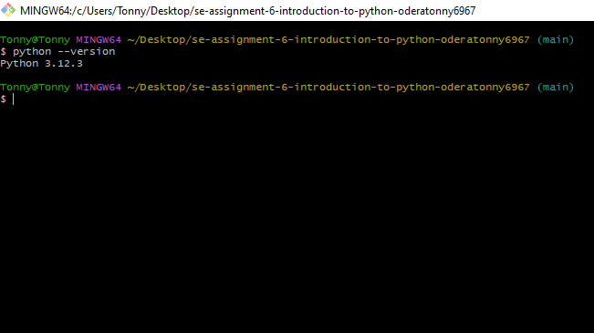
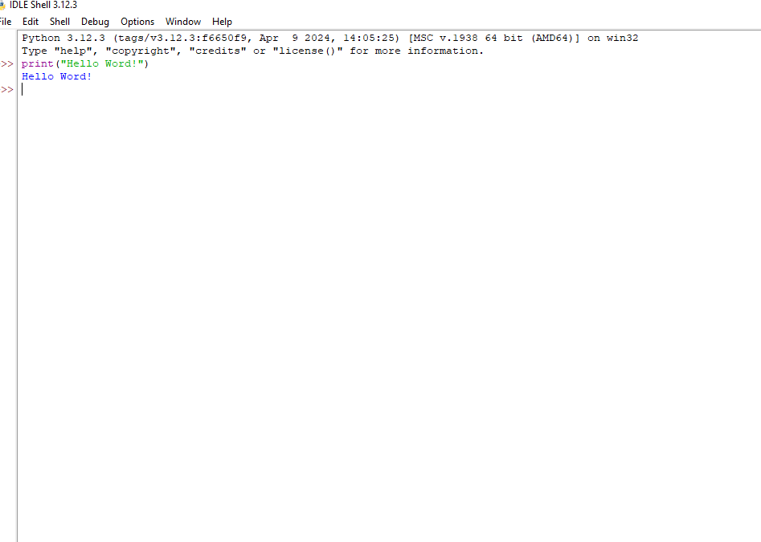
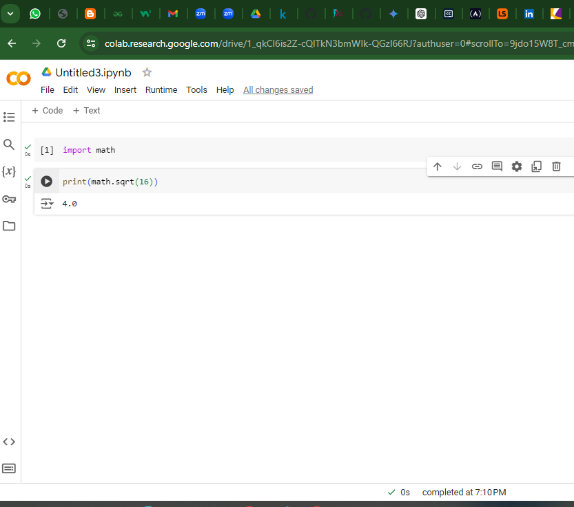

# SE-Assignment-6
 Assignment: Introduction to Python
Instructions:
Answer the following questions based on your understanding of Python programming. Provide detailed explanations and examples where appropriate.

 Questions:

1. Python Basics:
   - What is Python, and what are some of its key features that make it popular among developers? Provide examples of use cases where Python is particularly effective.
         Answers 
         Python is a powerful,high level  and versatile programming language known for its readability, simplicity, and extensive standard library.it is used for dataanalysis, webdevelopment,artificial intelligence .

         key features 
         . Is clean and easy to understand
         . Code is executed line-by-line, which makes debugging easier
         . Has a rich set of libraries and modules  making it be used in wide range of applications 

         Use Cases:

          . Web Development: Frameworks like Django and Flask are used in making websites 
          . Artificial intelligence : librsries like numpies ,pandas are used for datascience and data anlysis .

2. Installing Python:
   - Describe the steps to install Python on your operating system (Windows, macOS, or Linux). Include how to verify the installation and set up a virtual environment.
         Answers
         For Windows 
         . Download the latest Python installer from (https://www.python.org/downloads/windows/.)
         . Run the installer and follow the on-screen instructions.
         . Make sure to add Python to your system PATH environment variable during installation.
         Verify installation 
         . Open Command Prompt and type python --version to ensure Python is installed.

         NB : I already installed 
         

3. Python Syntax and Semantics:
   - Write a simple Python program that prints "Hello, World!" to the console. Explain the basic syntax elements used in the program.
            Answers 
            . print function: This function outputs data to the console.
            . Parentheses (): Enclose arguments passed to the function.
            . String literal: "Hello, World!" is a string enclosed in double quotes.
             NB :consistent identation is crucial in python 
            
            

4. Data Types and Variables:
   - List and describe the basic data types in Python. Write a short script that demonstrates how to create and use variables of different data types.

          . Integers: include Whole numbers
          . Floats: include Numbers with decimal points (e.g., 3.14, -9.25).
          . Strings: include Text data enclosed in quotes (e.g., "Hello", 'World').
          . Booleans: include True or False values.

5. Control Structures:
   - Explain the use of conditional statements and loops in Python. Provide examples of an `if-else` statement and a `for` loop.
               Answers 
              conditional statements and loops controls the flow of execution in your Python programs.

              Example of If-else loop 
              age = 18
                if age >= 18:
               print("You are eligible to vote.")
                     else:
               print("You are not eligible to vote.")
               Example of For loop

                  for i in range(5):
                       print(i) 

6. Functions in Python:
   - What are functions in Python, and why are they useful? Write a Python function that takes two arguments and returns their sum. Include an example of how to call this function.
       Answers 
       Functions are reusable pieces of code that perform specific tasks in python program. They areusefull because they promote readability , simplicity  .

       program code 
       def add(a, b):
             return a + b

        # here is where we are  Calling the function with arguments relacing the parameters 
       result = add(10, 50)
         print(result)
         # def key word of defining a function in python 
          # add(a,b) function name called add with parameters 
           #
            

7. Lists and Dictionaries:
   - Describe the differences between lists and dictionaries in Python. Write a script that creates a list of numbers and a dictionary with some key-value pairs, then demonstrates basic operations on both.
     Answers 
     Lists
     . Ordered collections of elements.
     . Elements can be of different data types.
     . Use square brackets [] to create and access elements.

     Dictionaries 
     . Unordered collections of key-value pairs.
     . Keys must be unique and immutable (e.g., strings, numbers).
     . Use curly braces {} to create and access elements using keys.

8. Exception Handling:
   - What is exception handling in Python? Provide an example of how to use `try`, `except`, and `finally` blocks to handle errors in a Python script.
     Answers 
       Exception handling allows you to manage errors that might occur during program execution.

       . try block: Contains code that might raise exceptions.
       . except block: Executes code to handle specific exceptions.
       . finally block: Always executes, regardless of exceptions.

9. Modules and Packages:
   - Explain the concepts of modules and packages in Python. How can you import and use a module in your script? Provide an example using the `math` module.
       Answers 
        Module - A single Python file that can be imported.
        Package - A directory containing multiple modules.

        

10. File I/O:
    - How do you read from and write to files in Python? Write a script that reads the content of a file and prints it to the console, and another script that writes a list of strings to a file.
      Answers 
open() function: Opens a file in a specific mode ("r" for reading).
with statement: Ensures proper file closing after use.
read() method: Reads the entire file content into a string.
Writing to Files:

open() function: Opens a file in write mode ("w" for overwriting).
with statement: Ensures proper file closing.
writelines() method: Writes a list of strings to the file.

# Submission Guidelines:
- Your answers should be well-structured, concise, and to the point.
- Provide code snippets or complete scripts where applicable.
- Cite any references or sources you use in your answers.
- Submit your completed assignment by [due date].

